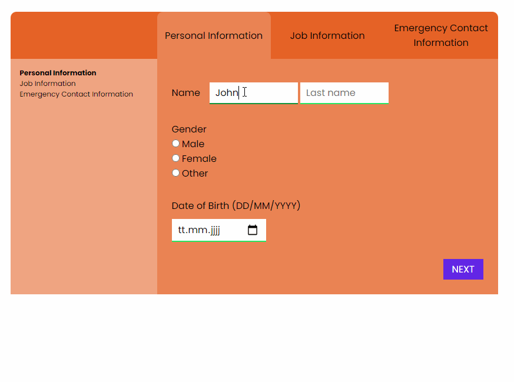

# Basic Form

In this project I created a Form that contains of three segments (Personal Information, Job Information, Emergency Contact Information). There is only one of the segments shown and you can switch between the segments with the next and previous buttons in the form or with the tabs at the top of the form. I used different input types like text, number, checkbox, radio buttons to collect the information. After the form gets send the information gets saved into a object which gets saved into sessionStorage. You get redirected to another site where you get a summary of the information you entered.

## Packages used
- sass 1.42.1
- gulp 4.0.2
- gulp-sass 5.0.0

## Preview

