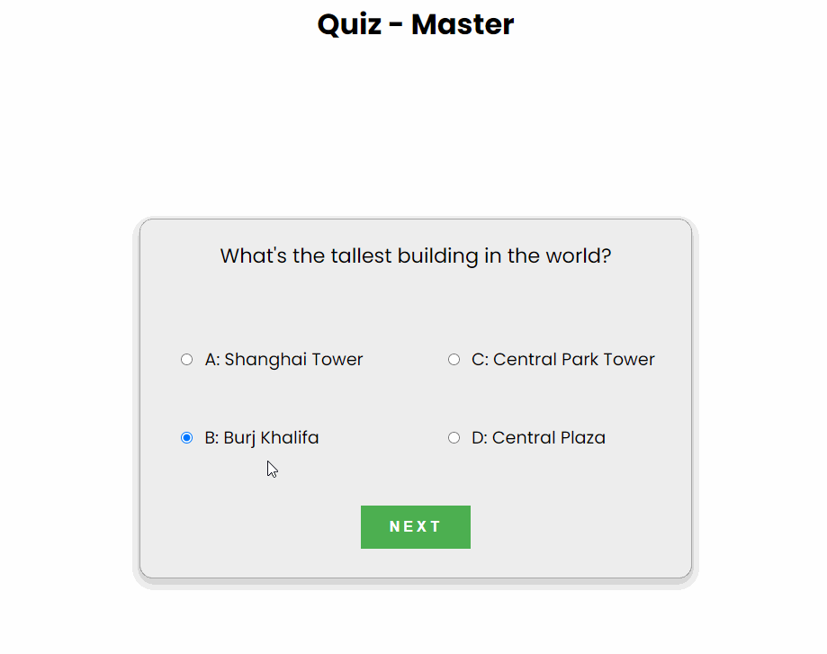
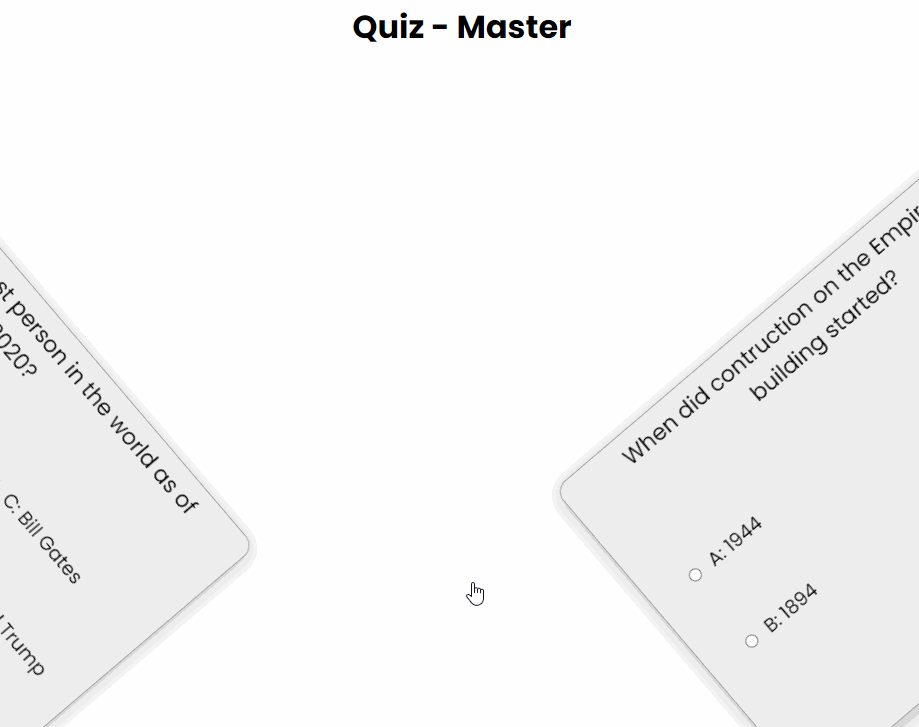

# Quiz Game Project

A little quiz game i created with only plain javascript. There are 20 questions and when you are finished you get your score and can see what questions you answered either right or wrong.
I also used sass for styling the application.

I got most questions from here:

- [https://www.ef.com/wwen/blog/language/questions-virtual-pub-quiz/
https://www.opinionstage.com/blog/trivia-questions/](https://www.ef.com/wwen/blog/language/questions-virtual-pub-quiz/)
- [https://www.opinionstage.com/blog/trivia-questions/](https://www.opinionstage.com/blog/trivia-questions/)

## Preview

